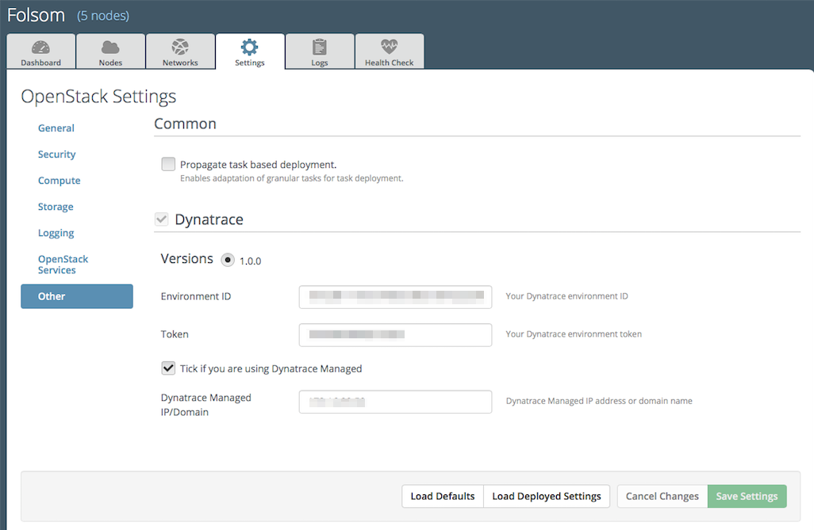

Installation Guide
------------------
This guide assumes that you have installed Fuel and all the nodes of your
future environment are discovered and functional.

Install Dynatrace Plugin
''''''''''''''''''''''''
1. Download the Dynatrace plugin from the `Dynatrace partner page
<https://www.mirantis.com/partners/dynatrace/>`_.
2. Copy the rpm package downloaded at the previous step to the Fuel Master
node.

 ``scp fuel-plugin-dynatrace-1.0-1.0.0-1.noarch.rpm <fuel-master-ip>:/tmp>``

3. Log into the Fuel Master node and install the plugin.

 ``ssh <the Fuel Master node ip>``

 ``fuel plugins --install fuel-plugin-dynatrace-1.0-1.0.0-1.noarch.rpm``

4. You should get the following output:

 ``Plugin <plugin-name-version>.rpm was successfully installed``

Configure Dynatrace Plugin
''''''''''''''''''''''''''
1. First, you need to create an environment in Fuel web UI.

2. Select *Install Dynatrace* in the *Additional Services* screen to be able
 to assign the *Dynatrace* role to nodes.

3. Enable the plugin and fill the configuration fields with correct values
of your Dynatrace environment (Settings > Other > Dynatrace).

 - Environment ID: your Dynatrace environment ID
 - Token: your Dynatrace environment token
 - Managed IP/Domain: if you have a Dynatrace Managed node/cluster setup in
 your environment, provide the IP address or the domain name

4. Add nodes and assign the *Dynatrace OneAgent* role to all controller nodes.
Assign the *Dynatrace Security Gateway* role to a node and don't assign any 
other roles to that node. Sample node configuration is provided below.

5. Finish the configuration according to your requirements.

6. Execute network connectivity check.

7. Press *Deploy changes* to deploy the environment.

Validate Dynatrace Plugin
'''''''''''''''''''''''''
1. After a successful deployment, ssh to the controller nodes and make sure 
 that there is a *oneagentwatchdog* process running.
2. After a successful deployment, ssh to the node with the *Dynatrace Security* 
 *Gateway* role. Make sure that there is a *dyntracegateway* process running.
3. After a successful deployment, log in to your Dynatrace environment and make
 sure that you find all nodes with the *Dynatrace OneAgent* role  in the host
 view and that you see, that one Security Gateway has been found in your environment.
